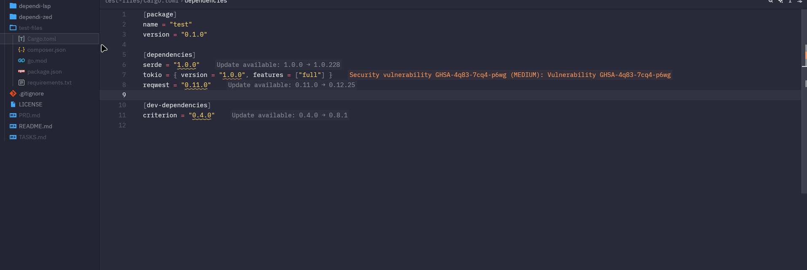

# Dependi for Zed

Dependency management extension for the [Zed](https://zed.dev) editor.

**Version:** 1.1.0



## Features

- **Inlay Hints**: See latest versions inline next to your dependencies
  - `✓` - Version is up to date
  - `-> X.Y.Z` - Update available
  - `⚠ N vulns` - Vulnerabilities detected
  - `⚠ Deprecated` - Package is deprecated
  - `⊘ Yanked` - Version has been yanked
  - `→ Local` - Local/path dependency
  - `? Unknown` - Could not fetch version info
- **Vulnerability Scanning**: Real-time security scanning via OSV.dev
  - CVE details in hover tooltips
  - Severity indicators: `⚠ CRITICAL`, `▲ HIGH`, `● MEDIUM`, `○ LOW`
  - Severity-based diagnostics (Critical/High → ERROR, Medium → WARNING, Low → HINT)
  - Generate JSON/Markdown vulnerability reports
- **Diagnostics**: Outdated dependencies are highlighted with hints
- **Code Actions**: Quick fix to update dependencies with semver-aware labels
  - `⚠ MAJOR`: Breaking changes (not auto-preferred)
  - `+ minor`: New features
  - `· patch`: Bug fixes
  - `* prerelease`: Experimental versions
- **Hover Info**: Package descriptions, licenses, and links
- **Autocompletion**: Version suggestions when editing dependencies
- **Persistent Cache**: SQLite cache for faster startup across sessions
- **Configurable**: Enable/disable features, ignore packages, adjust TTL

## Supported Languages

| Language | File | Registry | Status |
|----------|------|----------|--------|
| Rust | `Cargo.toml` | crates.io | ✅ |
| JavaScript/TypeScript | `package.json` | npm | ✅ |
| Python | `requirements.txt`, `pyproject.toml` | PyPI | ✅ |
| Go | `go.mod` | proxy.golang.org | ✅ |
| PHP | `composer.json` | Packagist | ✅ |
| Dart/Flutter | `pubspec.yaml` | pub.dev | ✅ |
| C#/.NET | `*.csproj` | NuGet | ✅ |
| Ruby | `Gemfile` | RubyGems.org | ✅ |

## Installation

### From Zed Extensions

1. Open Zed editor
2. Press `Cmd+Shift+P` (Mac) or `Ctrl+Shift+P` (Linux/Windows)
3. Type "extensions" and select `zed: extensions`
4. Search for "Dependi"
5. Click Install

The extension will automatically download and install the language server.

### Manual Installation (Development)

1. Clone this repository
2. Build the LSP and extension:

```bash
# Build the LSP
cd dependi-lsp
cargo build --release

# Build the extension
cd ../dependi-zed
cargo build --release --target wasm32-wasip1
```

3. In Zed, run `zed: install dev extension` and select the `dependi-zed` directory

## Project Structure

```
zed-dependi/
├── dependi-lsp/           # Language Server (Rust binary)
│   ├── src/
│   │   ├── main.rs        # Entry point
│   │   ├── lib.rs         # Library exports
│   │   ├── backend.rs     # LSP implementation
│   │   ├── config.rs      # Configuration management
│   │   ├── parsers/       # Dependency file parsers
│   │   │   ├── cargo.rs   # Cargo.toml parser
│   │   │   ├── npm.rs     # package.json parser
│   │   │   ├── python.rs  # requirements.txt, pyproject.toml
│   │   │   ├── go.rs      # go.mod parser
│   │   │   ├── php.rs     # composer.json parser
│   │   │   └── ruby.rs    # Gemfile parser
│   │   ├── registries/    # Package registry clients
│   │   │   ├── crates_io.rs
│   │   │   ├── npm.rs
│   │   │   ├── pypi.rs
│   │   │   ├── go_proxy.rs
│   │   │   ├── packagist.rs
│   │   │   └── rubygems.rs
│   │   ├── providers/     # LSP feature providers
│   │   │   ├── inlay_hints.rs
│   │   │   ├── diagnostics.rs
│   │   │   ├── code_actions.rs
│   │   │   └── completion.rs
│   │   └── cache/         # Caching layer
│   │       ├── mod.rs     # Memory + hybrid cache
│   │       └── sqlite.rs  # SQLite persistent cache
│   └── tests/             # Integration tests
├── dependi-zed/           # Zed Extension (WASM)
│   ├── extension.toml
│   └── src/lib.rs
└── .github/workflows/     # CI/CD
    ├── ci.yml             # Build & test
    └── release.yml        # Release binaries
```

## Development

### Prerequisites

- Rust 1.75+ (tested with 1.91.1)
- `wasm32-wasip1` target: `rustup target add wasm32-wasip1`

### Building

```bash
# Build LSP (release)
cd dependi-lsp
cargo build --release

# Run tests
cargo test

# Build extension
cd ../dependi-zed
cargo build --release --target wasm32-wasip1
```

### Testing

```bash
# Run all tests (66 tests)
cd dependi-lsp
cargo test

# Run specific test modules
cargo test parsers::cargo
cargo test parsers::python
cargo test parsers::go
cargo test registries
cargo test providers
```

### Debugging

```bash
# Run LSP with debug logs
cd dependi-lsp
RUST_LOG=debug cargo run

# View Zed logs
zed --foreground
```

## Configuration

Configure Dependi in your Zed `settings.json`:

```json
{
  "lsp": {
    "dependi": {
      "initialization_options": {
        "inlay_hints": {
          "enabled": true,
          "show_up_to_date": true
        },
        "diagnostics": {
          "enabled": true
        },
        "cache": {
          "ttl_secs": 3600
        },
        "security": {
          "enabled": true,
          "show_in_hints": true,
          "show_diagnostics": true,
          "min_severity": "low"
        },
        "ignore": ["internal-*", "test-pkg"]
      }
    }
  }
}
```

### Configuration Options

| Option | Type | Default | Description |
|--------|------|---------|-------------|
| `inlay_hints.enabled` | bool | `true` | Enable/disable inlay hints |
| `inlay_hints.show_up_to_date` | bool | `true` | Show hints for up-to-date packages |
| `diagnostics.enabled` | bool | `true` | Enable/disable diagnostics |
| `cache.ttl_secs` | number | `3600` | Cache TTL in seconds (1 hour) |
| `ignore` | string[] | `[]` | Package names/patterns to ignore |
| `security.enabled` | bool | `true` | Enable/disable vulnerability scanning |
| `security.show_in_hints` | bool | `true` | Show vulnerability count in inlay hints |
| `security.show_diagnostics` | bool | `true` | Show vulnerability diagnostics |
| `security.min_severity` | string | `"low"` | Minimum severity to report (low/medium/high/critical) |

## How It Works

1. When you open a dependency file, the LSP parses it to extract dependencies
2. For each dependency, it queries the appropriate registry
3. Version information is cached (memory + SQLite) to avoid repeated network requests
4. Inlay hints show whether each dependency is up-to-date or has updates available
5. Diagnostics highlight outdated dependencies
6. Code actions allow quick updates to the latest version
7. Hovering over a dependency shows detailed package information

## Architecture

```
┌─────────────────────────────────────────────────────────────┐
│                         Zed Editor                          │
├─────────────────────────────────────────────────────────────┤
│                    dependi-zed (WASM)                       │
│  - Downloads and launches the LSP binary                    │
└─────────────────────────────────────────────────────────────┘
                              │ stdio (JSON-RPC)
                              ▼
┌─────────────────────────────────────────────────────────────┐
│                   dependi-lsp (Binary)                      │
├─────────────────────────────────────────────────────────────┤
│  ┌──────────────┐  ┌──────────────┐  ┌──────────────┐      │
│  │   Parsers    │  │  Providers   │  │  Registries  │      │
│  ├──────────────┤  ├──────────────┤  ├──────────────┤      │
│  │ • Cargo.toml │  │ • Inlay Hints│  │ • crates.io  │      │
│  │ • package.json│ │ • Diagnostics│  │ • npm        │      │
│  │ • requirements│ │ • Code Action│  │ • PyPI       │      │
│  │ • pyproject  │  │ • Completion │  │ • Go Proxy   │      │
│  │ • go.mod     │  │ • Hover      │  │ • Packagist  │      │
│  │ • composer   │  └──────────────┘  │ • RubyGems   │      │
│  │ • Gemfile    │                    └──────────────┘      │
│  └──────────────┘                                           │
│                                                             │
│  ┌──────────────────────────────────────────────────────┐  │
│  │                    Cache Layer                        │  │
│  │  • Memory cache (fast access)                        │  │
│  │  • SQLite cache (persistent, ~/.cache/dependi/)      │  │
│  └──────────────────────────────────────────────────────┘  │
└─────────────────────────────────────────────────────────────┘
```

## Roadmap

- [x] **v0.1.0 (MVP)**: Cargo.toml + package.json support with inlay hints
- [x] **v0.2.0**: Python/Go/PHP support, diagnostics, code actions, SQLite cache, configuration
- [x] **v0.3.0**: Vulnerability detection (OSV.dev), Dart/Flutter and C#/.NET support
- [x] **v1.0.0**: Published to Zed Extensions marketplace ✨

## Contributing

Contributions are welcome! Please open an issue or submit a pull request.

## License

MIT - See [LICENSE](LICENSE)

## Acknowledgments

- Inspired by [Dependi for VS Code](https://github.com/filllabs/dependi)
- Built with [tower-lsp](https://github.com/ebkalderon/tower-lsp)
- Thanks to the Zed team for the excellent extension API
