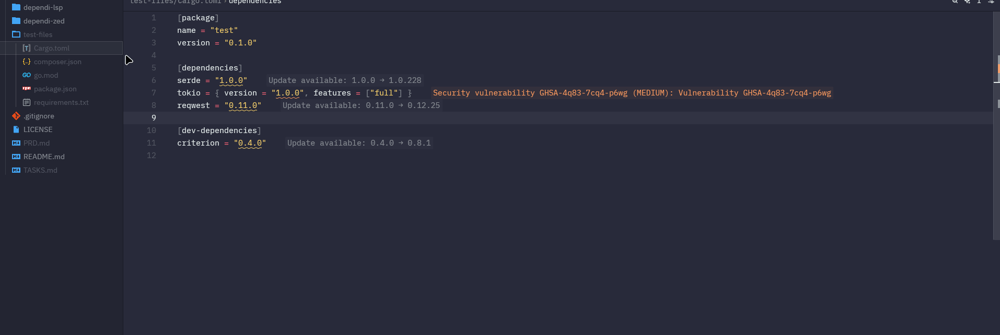

# Dependi for Zed

[](https://opensource.org/licenses/MIT)
[](https://mpiton.github.io/zed-dependi/)
[](https://github.com/mpiton/zed-dependi/actions/workflows/ci.yml)
[](https://github.com/mpiton/zed-dependi/releases)
[](https://github.com/mpiton/zed-dependi/issues)
[](https://github.com/mpiton/zed-dependi/pulls)
[](CODE_OF_CONDUCT.md)

Dependency management extension for the [Zed](https://zed.dev) editor.

**Version:** 1.5.0



📚 **Documentation**: [Full documentation available here](https://mpiton.github.io/zed-dependi/)

## Features

- **Inlay Hints**: See latest versions inline next to your dependencies
  - `✓` - Version is up to date
  - `-> X.Y.Z` - Update available
  - `⚠ N vulns` - Vulnerabilities detected
  - `⚠ Deprecated` - Package is deprecated
  - `⊘ Yanked` - Version has been yanked
  - `→ Local` - Local/path dependency
  - `? Unknown` - Could not fetch version info
- **Vulnerability Scanning**: Real-time security scanning via OSV.dev
  - CVE details in hover tooltips
  - Severity indicators: `⚠ CRITICAL`, `▲ HIGH`, `● MEDIUM`, `○ LOW`
  - Severity-based diagnostics (Critical/High → ERROR, Medium → WARNING, Low → HINT)
  - Generate JSON/Markdown vulnerability reports
- **Diagnostics**: Outdated dependencies are highlighted with hints
- **Code Actions**: Quick fix to update dependencies with semver-aware labels
  - `⚠ MAJOR`: Breaking changes (not auto-preferred)
  - `+ minor`: New features
  - `· patch`: Bug fixes
  - `* prerelease`: Experimental versions
- **Hover Info**: Package descriptions, licenses, and links
- **Autocompletion**: Version suggestions when editing dependencies
- **Persistent Cache**: SQLite cache for faster startup across sessions
- **Configurable**: Enable/disable features, ignore packages, adjust TTL

## Supported Languages

| Language | File | Registry | Status |
|----------|------|----------|--------|
| Rust | `Cargo.toml` | crates.io + alternative registries | ✅ |
| JavaScript/TypeScript | `package.json` | npm | ✅ |
| Python | `requirements.txt`, `constraints.txt`, `pyproject.toml` | PyPI | ✅ |
| Go | `go.mod` | proxy.golang.org | ✅ |
| PHP | `composer.json` | Packagist | ✅ |
| Dart/Flutter | `pubspec.yaml` | pub.dev | ✅ |
| C#/.NET | `*.csproj` | NuGet | ✅ |
| Ruby | `Gemfile` | RubyGems.org | ✅ |

## Installation

### From Zed Extensions

1. Open Zed editor
2. Press `Cmd+Shift+P` (Mac) or `Ctrl+Shift+P` (Linux/Windows)
3. Type "extensions" and select `zed: extensions`
4. Search for "Dependi"
5. Click Install

The extension will automatically download and install the language server.

### Manual Installation (Development)

1. Clone this repository
2. Build the LSP and extension:

```bash
# Build the LSP
cd dependi-lsp
cargo build --release

# Build the extension
cd ../dependi-zed
cargo build --release --target wasm32-wasip1
```

3. In Zed, run `zed: install dev extension` and select the `dependi-zed` directory

## Project Structure

```
zed-dependi/
├── dependi-lsp/           # Language Server (Rust binary)
│   ├── src/
│   │   ├── main.rs        # Entry point
│   │   ├── lib.rs         # Library exports
│   │   ├── backend.rs     # LSP implementation
│   │   ├── config.rs      # Configuration management
│   │   ├── parsers/       # Dependency file parsers
│   │   │   ├── cargo.rs   # Cargo.toml parser
│   │   │   ├── npm.rs     # package.json parser
│   │   │   ├── python.rs  # requirements.txt, constraints.txt, pyproject.toml
│   │   │   ├── go.rs      # go.mod parser
│   │   │   ├── php.rs     # composer.json parser
│   │   │   └── ruby.rs    # Gemfile parser
│   │   ├── registries/    # Package registry clients
│   │   │   ├── crates_io.rs
│   │   │   ├── npm.rs
│   │   │   ├── pypi.rs
│   │   │   ├── go_proxy.rs
│   │   │   ├── packagist.rs
│   │   │   └── rubygems.rs
│   │   ├── providers/     # LSP feature providers
│   │   │   ├── inlay_hints.rs
│   │   │   ├── diagnostics.rs
│   │   │   ├── code_actions.rs
│   │   │   └── completion.rs
│   │   └── cache/         # Caching layer
│   │       ├── mod.rs     # Memory + hybrid cache
│   │       └── sqlite.rs  # SQLite persistent cache
│   └── tests/             # Integration tests
├── dependi-zed/           # Zed Extension (WASM)
│   ├── extension.toml
│   └── src/lib.rs
└── .github/workflows/     # CI/CD
    ├── ci.yml             # Build & test
    └── release.yml        # Release binaries
```

## Development

### Prerequisites

- Rust 1.85+ (edition 2024)
- `wasm32-wasip1` target: `rustup target add wasm32-wasip1`

### Building

```bash
# Build LSP (release)
cd dependi-lsp
cargo build --release

# Run tests
cargo test

# Build extension
cd ../dependi-zed
cargo build --release --target wasm32-wasip1
```

### Testing

```bash
# Run all tests
cd dependi-lsp
cargo test

# Run specific test modules
cargo test parsers::cargo
cargo test parsers::python
cargo test parsers::go
cargo test registries
cargo test providers
```

### Debugging

```bash
# Run LSP with debug logs
cd dependi-lsp
RUST_LOG=debug cargo run

# View Zed logs
zed --foreground
```

## Configuration

Configure Dependi in your Zed `settings.json`:

```json
{
  "lsp": {
    "dependi": {
      "initialization_options": {
        "inlay_hints": {
          "enabled": true,
          "show_up_to_date": true
        },
        "diagnostics": {
          "enabled": true
        },
        "cache": {
          "ttl_secs": 3600
        },
        "security": {
          "enabled": true,
          "show_in_hints": true,
          "show_diagnostics": true,
          "min_severity": "low"
        },
        "ignore": ["internal-*", "test-pkg"]
      }
    }
  }
}
```

### Configuration Options

| Option | Type | Default | Description |
|--------|------|---------|-------------|
| `inlay_hints.enabled` | bool | `true` | Enable/disable inlay hints |
| `inlay_hints.show_up_to_date` | bool | `true` | Show hints for up-to-date packages |
| `diagnostics.enabled` | bool | `true` | Enable/disable diagnostics |
| `cache.ttl_secs` | number | `3600` | Cache TTL in seconds (1 hour) |
| `ignore` | string[] | `[]` | Package names/patterns to ignore |
| `security.enabled` | bool | `true` | Enable/disable vulnerability scanning |
| `security.show_in_hints` | bool | `true` | Show vulnerability count in inlay hints |
| `security.show_diagnostics` | bool | `true` | Show vulnerability diagnostics |
| `security.min_severity` | string | `"low"` | Minimum severity to report (low/medium/high/critical) |

### Private Registries

Dependi supports custom registries for enterprise environments.

#### Cargo Alternative Registries

Query private Cargo registries (Kellnr, Cloudsmith, Artifactory, etc.) alongside crates.io:

```json
{
  "lsp": {
    "dependi": {
      "initialization_options": {
        "registries": {
          "cargo": {
            "registries": {
              "my-registry": {
                "index_url": "https://my-registry.example.com/api/v1/crates",
                "auth": {
                  "type": "env",
                  "variable": "MY_REGISTRY_TOKEN"
                }
              }
            }
          }
        }
      }
    }
  }
}
```

Then in your `Cargo.toml`, use the `registry` field:

```toml
[dependencies]
my-crate = { version = "0.1.0", registry = "my-registry" }
serde = "1.0"  # still fetched from crates.io
```

**Key points:**
- The `index_url` is the sparse index URL (without the `sparse+` prefix)
- Authentication can be configured via LSP settings or falls back to `~/.cargo/credentials.toml`
- Dependencies without a `registry` field are fetched from crates.io as usual

#### npm Scoped Registries

Configure scoped registries to use private npm packages alongside public ones:

```json
{
  "lsp": {
    "dependi": {
      "initialization_options": {
        "registries": {
          "npm": {
            "url": "https://registry.npmjs.org",
            "scoped": {
              "company": {
                "url": "https://npm.company.com",
                "auth": {
                  "type": "env",
                  "variable": "COMPANY_NPM_TOKEN"
                }
              }
            }
          }
        }
      }
    }
  }
}
```

**Key points:**
- Scope names don't include the `@` prefix (use `"company"` not `"@company"`)
- Authentication tokens are read from environment variables (never hardcoded)
- Auth headers are only sent over HTTPS

For detailed configuration including supported registry types, authentication setup, and troubleshooting, see the [Private Registries Guide](docs/private-registries.md).

## CI/CD Integration

The dependi-lsp provides a standalone CLI scan command for integrating vulnerability scanning into your CI/CD pipelines.

### CLI Scan Command

```bash
dependi-lsp scan --file <path> [options]
```

#### Options

| Option | Short | Default | Description |
|--------|-------|---------|-------------|
| `--file <path>` | `-f` | required | Path to dependency file to scan |
| `--output <format>` | `-o` | `summary` | Output format: `summary`, `json`, `markdown` |
| `--min-severity <level>` | `-m` | `low` | Minimum severity to report: `low`, `medium`, `high`, `critical` |
| `--fail-on-vulns` | | `true` | Exit with code 1 if vulnerabilities are found |

#### Supported Files

- Rust: `Cargo.toml`
- JavaScript/TypeScript: `package.json`
- Python: `requirements.txt`, `constraints.txt`, `pyproject.toml`
- Go: `go.mod`
- PHP: `composer.json`
- Dart/Flutter: `pubspec.yaml`
- C#/.NET: `*.csproj`

#### Exit Codes

| Code | Meaning |
|------|---------|
| `0` | Success - no vulnerabilities found (or `--fail-on-vulns=false`) |
| `1` | Failure - vulnerabilities found, file error, or network error |

### Output Examples

#### Summary Output (default)

```bash
dependi-lsp scan --file Cargo.toml
```

```
Vulnerability Scan Results for Cargo.toml

  ⚠ Critical: 0
  ▲ High:     1
  ● Medium:   2
  ○ Low:      0
  ─────────────
  Total:      3

⚠ 3 vulnerabilities found!
```

#### JSON Output

```bash
dependi-lsp scan --file Cargo.toml --output json
```

```json
{
  "file": "Cargo.toml",
  "summary": {
    "total": 3,
    "critical": 0,
    "high": 1,
    "medium": 2,
    "low": 0
  },
  "vulnerabilities": [
    {
      "package": "tokio",
      "version": "1.35.0",
      "id": "RUSTSEC-2024-0001",
      "severity": "high",
      "description": "Race condition in tokio::time",
      "url": "https://rustsec.org/advisories/RUSTSEC-2024-0001"
    }
  ]
}
```

#### Markdown Output

```bash
dependi-lsp scan --file Cargo.toml --output markdown
```

Generates a formatted report with severity table and detailed vulnerability listings.

### CI/CD Pipeline Examples

#### GitHub Actions

Create `.github/workflows/security-scan.yml`:

```yaml
name: Security Scan

on:
  push:
    branches: [main]
  pull_request:
    branches: [main]

jobs:
  scan:
    runs-on: ubuntu-latest
    steps:
      - uses: actions/checkout@v4

      - name: Install Rust
        uses: dtolnay/rust-toolchain@stable

      - name: Install dependi-lsp
        run: cargo install --git https://github.com/mpiton/zed-dependi --bin dependi-lsp

      - name: Scan dependencies
        run: dependi-lsp scan --file Cargo.toml --min-severity high

      - name: Generate report
        if: always()
        run: |
          dependi-lsp scan --file Cargo.toml --output markdown > security-report.md

      - name: Upload report
        if: always()
        uses: actions/upload-artifact@v4
        with:
          name: security-report
          path: security-report.md
```

#### GitLab CI

Add to `.gitlab-ci.yml`:

```yaml
security-scan:
  stage: test
  image: rust:latest
  script:
    - cargo install --git https://github.com/mpiton/zed-dependi --bin dependi-lsp
    - dependi-lsp scan --file Cargo.toml --min-severity high
  artifacts:
    when: always
    paths:
      - security-report.md
    reports:
      sast: security-report.json
  allow_failure: false
```

### Best Practices

1. **Block on High/Critical**: Use `--min-severity high` to fail builds only on serious vulnerabilities
2. **Generate Reports**: Use `--output markdown` or `--output json` for audit trails
3. **Scheduled Scans**: Run daily scans to catch newly disclosed vulnerabilities
4. **Multiple Files**: Scan all dependency files in monorepos

## How It Works

1. When you open a dependency file, the LSP parses it to extract dependencies
2. For each dependency, it queries the appropriate registry
3. Version information is cached (memory + SQLite) to avoid repeated network requests
4. Inlay hints show whether each dependency is up-to-date or has updates available
5. Diagnostics highlight outdated dependencies
6. Code actions allow quick updates to the latest version
7. Hovering over a dependency shows detailed package information

## Architecture

```
┌─────────────────────────────────────────────────────────────┐
│                         Zed Editor                          │
├─────────────────────────────────────────────────────────────┤
│                    dependi-zed (WASM)                       │
│  - Downloads and launches the LSP binary                    │
└─────────────────────────────────────────────────────────────┘
                              │ stdio (JSON-RPC)
                              ▼
┌─────────────────────────────────────────────────────────────┐
│                   dependi-lsp (Binary)                      │
├─────────────────────────────────────────────────────────────┤
│  ┌──────────────┐  ┌──────────────┐  ┌──────────────┐      │
│  │   Parsers    │  │  Providers   │  │  Registries  │      │
│  ├──────────────┤  ├──────────────┤  ├──────────────┤      │
│  │ • Cargo.toml │  │ • Inlay Hints│  │ • crates.io  │      │
│  │ • package.json│ │ • Diagnostics│  │ • Cargo alt  │      │
│  │ • requirements│ │ • Code Action│  │ • npm        │      │
│  │ • constraints│  │ • Completion │  │ • PyPI       │      │
│  │ • pyproject  │  │ • Hover      │  │ • Go Proxy   │      │
│  │ • go.mod     │  │ • Hover      │  │ • Packagist  │      │
│  │ • composer   │  └──────────────┘  │ • RubyGems   │      │
│  │ • Gemfile    │                    └──────────────┘      │
│  └──────────────┘                                           │
│                                                             │
│  ┌──────────────────────────────────────────────────────┐  │
│  │                    Cache Layer                        │  │
│  │  • Memory cache (fast access)                        │  │
│  │  • SQLite cache (persistent, ~/.cache/dependi/)      │  │
│  └──────────────────────────────────────────────────────┘  │
└─────────────────────────────────────────────────────────────┘
```

## Troubleshooting

### LSP Server Not Starting

**Symptoms:**
- No inlay hints or diagnostics appear
- No completions for dependency versions
- Extension seems inactive

**Solutions:**
1. Check Zed's extension panel to verify Dependi is installed and enabled
2. View Zed logs for errors: run `zed --foreground` from terminal
3. Reinstall the extension from Zed Extensions marketplace
4. Check if firewall/proxy is blocking network requests to package registries

### LSP Server Crashes or Freezes

**Symptoms:**
- Editor becomes unresponsive when opening dependency files
- LSP process repeatedly restarts
- High memory usage

**Solutions:**
1. Clear the cache directory and restart Zed:
   ```bash
   # Linux
   rm -rf ~/.cache/dependi/

   # macOS
   rm -rf ~/Library/Caches/dependi/

   # Windows
   rmdir /s %LOCALAPPDATA%\dependi
   ```
2. Update to the latest Dependi version
3. Check if the issue occurs with a specific dependency file
4. File a bug report with reproduction steps

### Outdated Cache Data

**Symptoms:**
- Recently published packages not showing as latest
- Old version information displayed
- Known updates not appearing

**Solutions:**
1. Cache automatically refreshes after 1 hour (default TTL)
2. Clear cache manually to force refresh:
   ```bash
   rm -rf ~/.cache/dependi/
   ```
3. Restart Zed after clearing cache
4. Verify the registry is accessible (try visiting crates.io, npmjs.com, etc.)

### Registry Rate Limiting

**Symptoms:**
- Intermittent failures fetching package info
- `? Unknown` hints appearing temporarily
- Slow responses when opening files

**Solutions:**
1. Wait a few minutes for rate limits to reset
2. The cache reduces API calls - avoid clearing cache unnecessarily
3. For npm, consider setting up authentication (see registry documentation)
4. Large monorepos may trigger rate limits - be patient on first load

### Network/Proxy Issues

**Symptoms:**
- All package lookups failing
- Timeout errors in logs
- Works on some networks but not others

**Solutions:**
1. Configure system proxy settings (Dependi uses system proxy)
2. Ensure registry URLs are allowed through corporate firewall:
   - `https://crates.io`
   - `https://registry.npmjs.org`
   - `https://pypi.org`
   - `https://proxy.golang.org`
   - `https://packagist.org`
   - `https://pub.dev`
   - `https://api.nuget.org`
   - `https://rubygems.org`
   - `https://api.osv.dev` (vulnerability scanning)
3. Check DNS resolution for registry domains
4. Try temporarily disabling VPN if using one

### Configuration Not Applying

**Symptoms:**
- Custom settings in `settings.json` are ignored
- Default behavior despite configuration changes

**Solutions:**
1. Verify JSON syntax is valid in `settings.json`
2. Ensure settings are under the correct path:
   ```json
   {
     "lsp": {
       "dependi": {
         "initialization_options": {
           // your settings here
         }
       }
     }
   }
   ```
3. Restart Zed after configuration changes
4. Check for typos in setting names (see Configuration Options table above)

## FAQ

### How does the cache work?

Dependi uses a hybrid caching system:
- **Memory cache**: Fast access during the current session
- **SQLite cache**: Persistent storage in the system cache directory:
  - Linux: `~/.cache/dependi/cache.db`
  - macOS: `~/Library/Caches/dependi/cache.db`
  - Windows: `%LOCALAPPDATA%\dependi\cache.db`

Cache entries expire after 1 hour by default (configurable via `cache.ttl_secs`). Vulnerability data is cached for 6 hours. When you open a dependency file, cached data is used immediately while fresh data is fetched in the background.

### How do I clear the cache?

Delete the cache directory:
```bash
# Linux
rm -rf ~/.cache/dependi/

# macOS
rm -rf ~/Library/Caches/dependi/

# Windows
rmdir /s %LOCALAPPDATA%\dependi
```
Then restart Zed. The cache will rebuild as you open dependency files.

### Can I use this offline?

Yes, with limitations. If packages were previously cached, their information remains available offline until the cache expires. New packages or those not in cache won't have version information. For fully offline work, consider increasing the cache TTL:
```json
{
  "lsp": {
    "dependi": {
      "initialization_options": {
        "cache": {
          "ttl_secs": 86400
        }
      }
    }
  }
}
```

### Which package registries are supported?

| Language | Registry | URL |
|----------|----------|-----|
| Rust | crates.io (+ alternative registries) | https://crates.io |
| JavaScript/TypeScript | npm | https://registry.npmjs.org |
| Python | PyPI | https://pypi.org |
| Go | Go Proxy | https://proxy.golang.org |
| PHP | Packagist | https://packagist.org |
| Dart/Flutter | pub.dev | https://pub.dev |
| C#/.NET | NuGet | https://api.nuget.org |
| Ruby | RubyGems | https://rubygems.org |

### What data does the extension collect?

Dependi:
- Fetches package metadata from public registries
- Queries OSV.dev API for vulnerability information
- Caches all data locally on your machine
- Does **NOT** send your code, file contents, or personal data anywhere
- Only makes requests to official package registries and OSV.dev

### How does vulnerability scanning work?

Dependi queries the [OSV.dev](https://osv.dev) API (Google's Open Source Vulnerability database) for each of your dependencies. The results show:
- **Severity levels**: Critical, High, Medium, Low
- **CVE/Advisory IDs** in hover tooltips
- **Diagnostic markers** in the editor

Configure minimum severity level with `security.min_severity`:
```json
{
  "lsp": {
    "dependi": {
      "initialization_options": {
        "security": {
          "min_severity": "high"
        }
      }
    }
  }
}
```

### How do I disable specific features?

Use `initialization_options` in your Zed settings:
```json
{
  "lsp": {
    "dependi": {
      "initialization_options": {
        "inlay_hints": { "enabled": false },
        "diagnostics": { "enabled": false },
        "security": { "enabled": false }
      }
    }
  }
}
```

### How do I ignore certain packages?

Use the `ignore` setting with glob patterns:
```json
{
  "lsp": {
    "dependi": {
      "initialization_options": {
        "ignore": ["internal-*", "my-private-pkg", "@company/*"]
      }
    }
  }
}
```

### Why do some packages show "? Unknown"?

This can happen when:
- The package doesn't exist on the registry
- Network request failed or timed out
- Registry is temporarily unavailable
- Package name has a typo

Check your network connection and verify the package exists on its registry.

### Can I see outdated packages without inlay hints?

Yes! Even with inlay hints disabled, diagnostics will highlight outdated dependencies. Enable diagnostics in settings:
```json
{
  "lsp": {
    "dependi": {
      "initialization_options": {
        "diagnostics": { "enabled": true }
      }
    }
  }
}
```

### How do I report a bug or request a feature?

1. Check [existing issues](https://github.com/mpiton/zed-dependi/issues) first
2. Open a new issue with:
   - Dependi version
   - Zed version
   - Operating system
   - Steps to reproduce
   - Expected vs actual behavior
   - Relevant logs (`zed --foreground`)

### How do I contribute?

See [CONTRIBUTING.md](CONTRIBUTING.md) for guidelines. Briefly:
1. Fork the repository
2. Create a feature branch
3. Make changes and add tests
4. Run `cargo test` and `cargo clippy`
5. Submit a pull request

## Roadmap

- [x] **v0.1.0 (MVP)**: Cargo.toml + package.json support with inlay hints
- [x] **v0.2.0**: Python/Go/PHP support, diagnostics, code actions, SQLite cache, configuration
- [x] **v0.3.0**: Vulnerability detection (OSV.dev), Dart/Flutter and C#/.NET support
- [x] **v1.0.0**: Published to Zed Extensions marketplace ✨

## Contributing

Contributions are welcome! See [CONTRIBUTING.md](CONTRIBUTING.md) for detailed guidelines on:
- Setting up your development environment
- Code style and standards
- Adding support for new languages
- Submitting pull requests

## License

MIT - See [LICENSE](LICENSE)

## Acknowledgments

- Inspired by [Dependi for VS Code](https://github.com/filllabs/dependi)
- Built with [tower-lsp](https://github.com/ebkalderon/tower-lsp)
- Thanks to the Zed team for the excellent extension API
