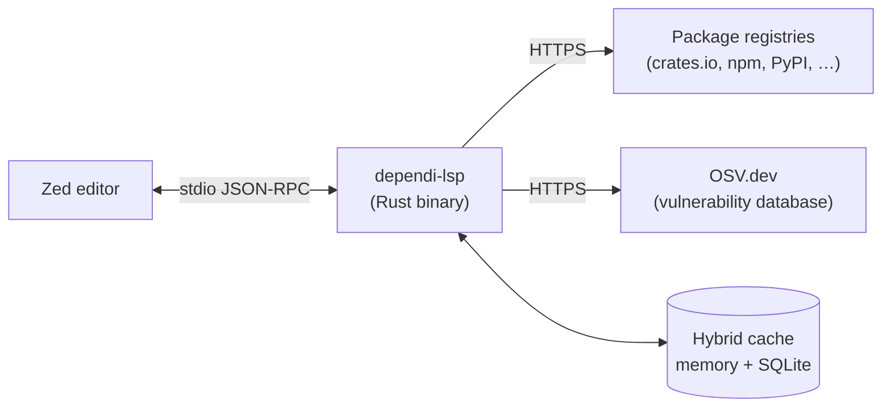
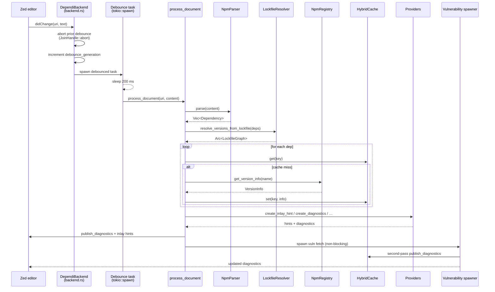
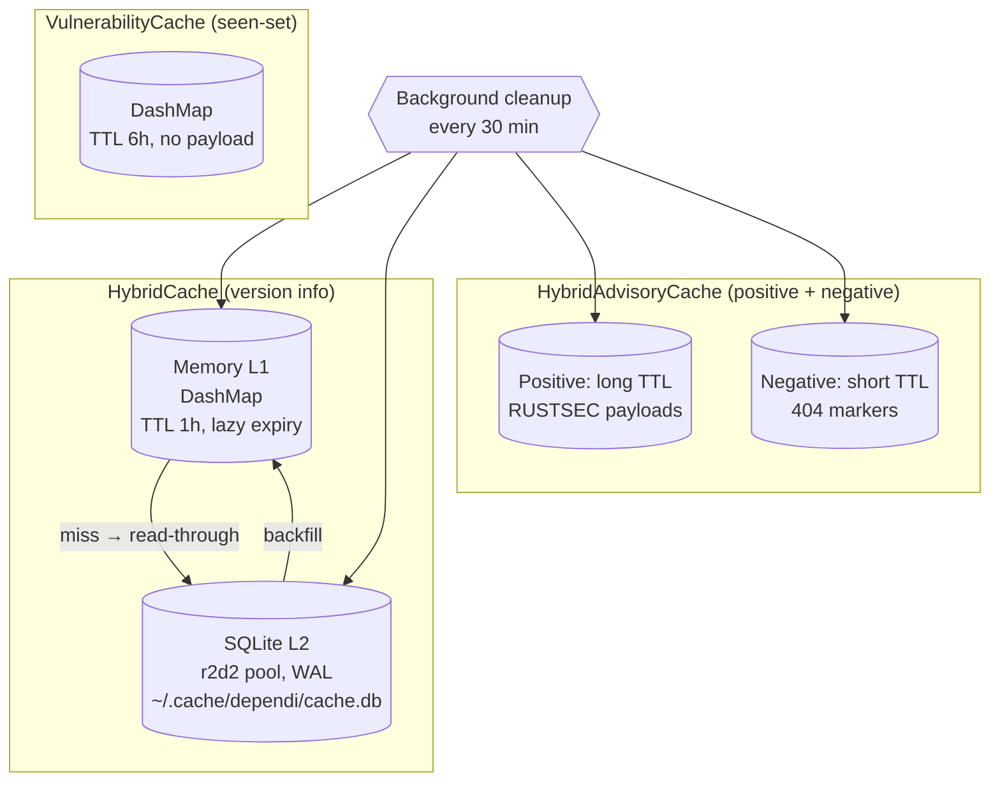
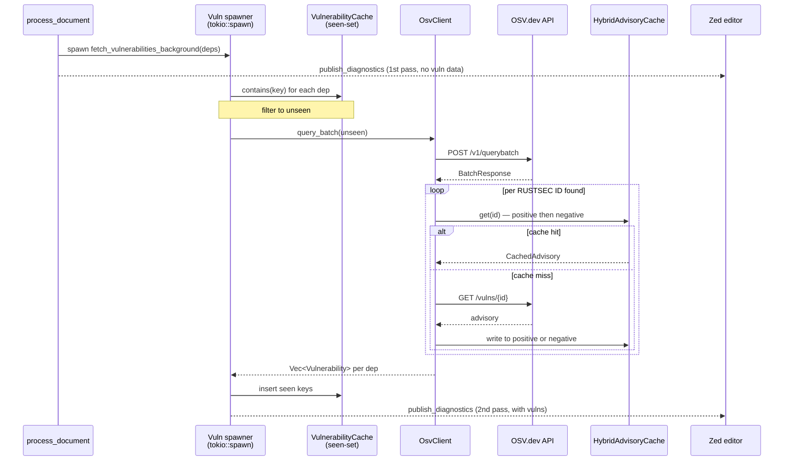

# Dependi LSP Architecture

> Audience: contributors. Read the [Architecture section in README.md](../README.md#architecture) and [Configuration]() first for user-facing context — this guide expands README's high-level diagram into the full layered model.

## Table of Contents

1. [Introduction](#1-introduction)
2. [Top-Level Architecture](#2-top-level-architecture)
3. [Request Lifecycle](#3-request-lifecycle)
4. [Core Data Structures](#4-core-data-structures)
5. [Parsers](#5-parsers)
6. [Registries](#6-registries)
7. [Cache Strategy](#7-cache-strategy)
8. [Vulnerability Path](#8-vulnerability-path)
9. [Providers](#9-providers)
10. [Authentication & Private Registries](#10-authentication--private-registries)
11. [Key Design Decisions](#11-key-design-decisions)
12. [Glossary & Further Reading](#12-glossary--further-reading)

## 1. Introduction

This document describes the internal architecture of the **Dependi LSP server** (`dependi-lsp/`) — the Rust binary that implements the Language Server Protocol providing dependency hints, vulnerability scanning, code actions and completions for the [Zed editor](https://zed.dev).

### Audience

Contributors who want to add an ecosystem, fix a bug, optimise a hot path, or simply build a mental model of how a request flows through the system.

### What this document IS

- A guided tour of the LSP server's internals.
- A high-fidelity sequence diagram of the request lifecycle.
- An explanation of the design decisions (caching strategy, concurrency, debouncing).
- A map of which module owns which responsibility.

### What this document is NOT

- A user-facing how-to (see [Installation]() and [Configuration]()).
- An API reference for public types — that lives in `cargo doc`.
- A per-ecosystem parsing reference (see [Languages]()).

### System boundary



The LSP communicates with Zed over stdio JSON-RPC (initiated by [`dependi-zed/`](../dependi-zed/) — a thin WASM extension). It fans out to package registries (per ecosystem) and to OSV.dev for vulnerability data. All network responses are cached in a two-tier hybrid store.

## 2. Top-Level Architecture

The LSP is organised as five layers, each occupying a single subdirectory of `dependi-lsp/src/`:

| Layer | Modules | Responsibility |
|---|---|---|
| **Transport** | `main.rs`, `lib.rs` | Bootstrap, CLI parsing (`clap`), tokio runtime, JSON-RPC stdio loop via `tower-lsp`. |
| **Handlers** | `backend.rs` | Implements `tower_lsp::LanguageServer`; owns shared state (`DependiBackend`); routes LSP requests to providers. |
| **Providers** | `dependi-lsp/src/providers/` | Five plain functions producing LSP responses: inlay hints, diagnostics, code actions, completions, document links. |
| **Domain** | `dependi-lsp/src/parsers/`, `dependi-lsp/src/registries/`, `dependi-lsp/src/auth/`, `dependi-lsp/src/vulnerabilities/` | Manifest parsing, registry HTTP clients, credential resolution, OSV vulnerability queries. |
| **Cache** | `dependi-lsp/src/cache/` | Two-tier hybrid cache (memory + SQLite) for version info; separate caches for vulnerability seen-set and OSV advisories. |

### Module map

| Path | Role |
|---|---|
| `dependi-lsp/src/main.rs` | Entry: tokio runtime, CLI subcommands, stdio LSP loop. |
| `dependi-lsp/src/backend.rs` | `DependiBackend` — central handler struct; debounce + dispatch. |
| `dependi-lsp/src/config.rs` | Workspace config (registries, auth, cache TTL, debounce ms). |
| `dependi-lsp/src/document.rs` | Text/document utilities. |
| `dependi-lsp/src/file_types.rs` | `FileType` enum + path-pattern → ecosystem detection. |
| `dependi-lsp/src/document.rs` | `DocumentState` per-open-document snapshot. |
| `dependi-lsp/src/reports.rs` | JSON / Markdown vulnerability report generation. |
| `dependi-lsp/src/settings_edit.rs` | Programmatic edits to user settings (used by code actions). |
| `dependi-lsp/src/utils.rs` | Shared utilities. |
| `dependi-lsp/src/auth/` | Token providers, cargo credentials, npmrc parsing. |
| `dependi-lsp/src/parsers/` | Per-ecosystem parsers (cargo, npm, python, go, php, dart, csharp, ruby, maven) + lockfile resolvers (`lockfile_resolver.rs`, `lockfile_graph.rs`). |
| `dependi-lsp/src/providers/` | Five LSP feature implementations. |
| `dependi-lsp/src/registries/` | Registry HTTP clients (incl. `maven_central.rs`) + shared `reqwest::Client`. |
| `dependi-lsp/src/vulnerabilities/` | OSV client + vulnerability seen-set cache. |
| `dependi-lsp/src/cache/` | Hybrid cache, advisory cache. |

The strict directional rule: **handlers call providers, providers call domain modules, domain modules read/write the cache.** Providers do not call each other; domain modules do not call handlers.

**Adding a new ecosystem?** The parser (§5), registry (§6) and `FileType` entry (§2 above) are the three touch-points. A step-by-step walkthrough is in [Adding a language]().

## 3. Request Lifecycle

A typical edit-to-hint cycle illustrates how the layers interact. Below is the path of a `textDocument/didChange` notification on `package.json`.



### Key invariants

- **Debounce** (coalescing rapid keystrokes into one delayed action): every `didChange` writes the new content into `pending_changes`, aborts the previous `JoinHandle`, and spawns a fresh task. After sleeping 200 ms the task verifies *its* content is still the value in `pending_changes` (an equality check on the buffered text) — if a newer keystroke arrived, that buffer was overwritten and this task exits without doing work. An `Arc<AtomicU64>` generation counter is used independently to clean up the per-URI `debounce_tasks` slot via `remove_if(stored_gen == generation)`. Full rationale in [§11 Key Design Decisions](#11-key-design-decisions).
- **Per-document bounded concurrency:** each `process_document` call constructs its own `tokio::sync::Semaphore::new(5)` inline (`backend.rs`) — it is **not** a field of `ProcessingContext` and does **not** cap *global* registry traffic. The cap is per-document: a single document is limited to 5 concurrent registry fetches; multiple documents being processed in parallel each get their own semaphore.
- **Vulnerabilities never block hints:** the vuln path is a separate `tokio::spawn`. Inlay hints publish first; vulnerability diagnostics arrive in a second pass.
- **Document state lives in `Arc<DashMap<Url, DocumentState>>`** — `DashMap` shards are independently locked, so two handlers reading different URIs never block each other. Handlers snapshot the fields they need into locals and drop the `Ref` (the `DashMap` shard reference) before any `await`, since shard references are not `Send`.

The `did_open`, `did_save` and `did_close` paths share the same skeleton minus the debounce: open and save run `process_document` immediately, close removes the entry from `documents` and any pending debounce.

## 4. Core Data Structures

Six types form the spine of the system.

### `DependiBackend` (`dependi-lsp/src/backend.rs`)

The central handler struct that implements `tower_lsp::LanguageServer`. All shared state hangs off here as `Arc<…>` pointers so each LSP handler can hold a cheap clone:

| Field group | Purpose |
|---|---|
| `client: tower_lsp::Client` | Outbound channel to Zed (publish diagnostics, send requests). |
| `config: Arc<RwLock<Config>>` | Workspace configuration. |
| `documents: Arc<DashMap<Url, DocumentState>>` | Per-document parsed state. |
| `<ecosystem>_parser` (9 fields) | Per-ecosystem `Arc<XxxParser>`. |
| `<ecosystem>_registry` (8 fields) | Per-ecosystem registry clients. |
| `cargo_custom_registries: Arc<DashMap<String, Arc<CargoSparseRegistry>>>` | Alternative cargo registries keyed by name. |
| `http_client: Arc<reqwest::Client>` | Shared HTTP client (one connection pool). |
| `token_manager: Arc<TokenProviderManager>` | URL → auth-header resolution. |
| `osv_client`, `vuln_cache`, `advisory_cache`, `negative_advisory_cache` | Vulnerability subsystem. |
| `transitive_vuln_data: Arc<DashMap<VulnCacheKey, Vec<Vulnerability>>>` | Per-package transitive vuln payloads. |
| `debounce_tasks: Arc<DashMap<Url, (u64, JoinHandle<()>)>>`, `debounce_generation: Arc<AtomicU64>`, `pending_changes: Arc<DashMap<Url, String>>` | Debounce coordination. |
| `version_cache: Arc<HybridCache>` | Two-tier version-info cache. |

### `Dependency` (`dependi-lsp/src/parsers/mod.rs`)

The output of every parser:

| Field | Type | Purpose |
|---|---|---|
| `name` | `String` | Package name as declared. |
| `version` | `String` | Version constraint as declared. |
| `name_span`, `version_span` | `Span` | LSP-friendly source ranges. |
| `dev`, `optional` | `bool` | Manifest flags. |
| `registry` | `Option<String>` | Alternative registry name (cargo-only at present). |
| `resolved_version` | `Option<String>` | Concrete version from a lockfile, populated post-parse. |

### `Span` (`dependi-lsp/src/parsers/mod.rs`)

```rust
pub struct Span {
    pub line: u32,        // 0-indexed line number
    pub line_start: u32,  // byte offset, relative to start of line
    pub line_end: u32,    // byte offset (exclusive), relative to start of line
}
```

Note the offsets are **line-relative byte offsets**, not file-relative. This makes conversion to LSP positions trivial: line is direct, character is computed by counting UTF-16 code units in `line[line_start..line_end]`.

### `VersionInfo` (`dependi-lsp/src/registries/mod.rs`)

Returned by every registry client. Contains `latest`, `latest_prerelease`, `versions: Vec<String>`, `description`, `homepage`, `repository`, `license`, `vulnerabilities`, `deprecated`, `yanked_versions`, `release_dates: HashMap<String, DateTime<Utc>>`, `transitive_vulnerabilities`. Vulnerability fields are populated separately (after the OSV pass) — registry clients themselves never query OSV.

### `DocumentState` (`dependi-lsp/src/document.rs`)

Per-open-document snapshot held in `documents: DashMap<Url, DocumentState>` on the backend. Stores parsed dependencies, file type, content, last-publish timestamps. Read once into a local then `Ref` dropped — never held across `await`.

### `FileType` (`dependi-lsp/src/file_types.rs`)

A `Copy`-able enum tagging the ecosystem of an open file: `Cargo`, `Npm`, `Python` (covers `requirements.txt`, `constraints.txt`, `pyproject.toml`, `hatch.toml`), `Go`, `Php`, `Dart`, `Csharp`, `Ruby`, `Maven`. Single source of truth used by handlers, parsers and providers when picking ecosystem-specific behaviour. Lockfiles do *not* get their own variants — the ecosystem variant identifies both manifest and lockfile, and `lockfile_resolver.rs` handles per-ecosystem dispatch.

## 5. Parsers

### The `Parser` trait

Every manifest parser implements a deliberately tiny trait (`dependi-lsp/src/parsers/mod.rs`):

```rust
pub trait Parser: Send + Sync {
    fn parse(&self, content: &str) -> Vec<Dependency>;
}
```

Synchronous, infallible, malformed input silently yields an empty `Vec`. Rationale: LSP fires `parse` on every keystroke (after debounce) — we cannot stop the world for a TOML error, so we degrade gracefully and let the editor's native syntax checker flag invalid manifests.

### Span model

Each `Dependency` carries `name_span` and `version_span` of type `Span`. Spans use **byte offsets relative to the start of the line**, not the start of the file. This was a conscious choice — see [§11 Key Design Decisions](#11-key-design-decisions).

### File type routing

Routing is performed by `FileType::detect` in `dependi-lsp/src/file_types.rs` — pure path matching, no trait dispatch:

```rust
pub fn detect(uri: &Url) -> Option<Self> {
    let path = uri.path();
    if path.ends_with("Cargo.toml")        { Some(FileType::Cargo) }
    else if path.ends_with("package.json") { Some(FileType::Npm) }
    // … etc.
    else { None }
}
```

The downstream `process_document` switches on the resulting `FileType` to pick the right `Arc<XxxParser>` from `DependiBackend`. Static dispatch, zero virtual calls.

### Lockfile resolution

Two cooperating modules turn `Cargo.lock` / `package-lock.json` / `composer.lock` / `pubspec.lock` / `go.sum` / `Gemfile.lock` / etc. into structured graphs:

- **`LockfileResolver` trait** (`dependi-lsp/src/parsers/lockfile_resolver.rs`) — async trait with `find_lockfile`, `parse_graph`, `normalize_name`, `resolve_version`. `select_resolver(file_type)` returns the per-ecosystem implementation as `Box<dyn LockfileResolver>`. The free function `resolve_versions_from_lockfile(deps: &mut [Dependency], resolver: Box<dyn LockfileResolver>, manifest_path: &Path) -> Option<Arc<LockfileGraph>>` then locates the lockfile, parses the graph, and back-fills each `dep.resolved_version` in place; the returned graph feeds the vulnerability pass.
- **`LockfileGraph`** (`dependi-lsp/src/parsers/lockfile_graph.rs`) — DFS algorithms over `Vec<LockfilePackage>`:
  - `transitive_deps_of(name)` — cycle-safe DFS, multi-version aware.
  - `transitives_only(direct)` — reachability filter for "what is brought in by this top-level dep".
  - `reverse_index()` — transitive → direct attribution map (used to point a vulnerability in `lodash` back to the user's `gulp` declaration).

The graph is consumed downstream for vulnerability attribution — version selection itself is the resolver's job, not the graph's.

## 6. Registries

### The `Registry` trait

Every registry client implements a small async trait (`dependi-lsp/src/registries/mod.rs`):

```rust
#[allow(async_fn_in_trait)]
pub trait Registry: Send + Sync {
    async fn get_version_info(&self, package_name: &str) -> anyhow::Result<VersionInfo>;
    fn http_client(&self) -> Arc<Client>;
}
```

Each implementation owns its registry-specific URL templates, response parsing and error mapping (404 → "not found", 429 → retry-after honoured, 5xx → `anyhow::Error`).

### Shared `reqwest::Client`

A single `Arc<reqwest::Client>` is created once at startup by `create_shared_client` in `dependi-lsp/src/registries/http_client.rs` and threaded into every registry via `with_client(Arc<Client>)`. Important properties:

- `pool_max_idle_per_host = 10`
- `tcp_keepalive = 60s`
- `pool_idle_timeout = 90s`
- `timeout = 10s`, `connect_timeout = 5s`

Sharing the client means **one TCP connection pool serves all 10 registry clients** (`crates_io`, `cargo_sparse`, `npm`, `pypi`, `go_proxy`, `packagist`, `pub_dev`, `nuget`, `rubygems`, `maven_central`), dramatically reducing handshake overhead for the typical "user opened a polyglot monorepo" scenario.

There is no HTTP-level cache. Caching happens at the application layer (see [§7 Cache Strategy](#7-cache-strategy)) where we serialise full `VersionInfo` records, not raw HTTP bodies.

### Bounded concurrency

`process_document` builds a `tokio::sync::Semaphore::new(5)` per request (created inline; not a field of `ProcessingContext`) and acquires a permit before each `get_version_info` call. Five in-flight requests is enough to saturate a slow-path lockfile while staying polite to public registries. For per-registry rate limits and HTTP API details see [Registries]().

### Per-ecosystem clients

| Module | Registry | Notes |
|---|---|---|
| `crates_io.rs` | crates.io | Used for the canonical cargo registry. |
| `cargo_sparse.rs` | Alternative cargo registries (sparse index) | Per-registry instances stored in `cargo_custom_registries: DashMap<String, Arc<…>>`. |
| `npm.rs` | npm | Behind `RwLock` to allow runtime reconfiguration of registry URL via `.npmrc`. |
| `pypi.rs` | PyPI | JSON API. |
| `go_proxy.rs` | proxy.golang.org | Honours `GOPROXY` env. |
| `packagist.rs` | Packagist (PHP) | |
| `pub_dev.rs` | pub.dev (Dart) | |
| `nuget.rs` | NuGet | |
| `rubygems.rs` | RubyGems | |
| `maven_central.rs` | Maven Central | Behind `RwLock` for repository reconfiguration. |

Two tiny utility modules sit alongside: `version_utils.rs` (semver helpers shared across ecosystems) and `url_sanitizer.rs` (strips credentials / normalises registry URLs before logging).

## 7. Cache Strategy

Three independent caches each live in `dependi-lsp/src/cache/`. They serve different access patterns and have different TTLs.



### `HybridCache` — version info

Two-tier read-through, write-through cache (`dependi-lsp/src/cache/mod.rs`):

- **L1 = `MemoryCache`** — `DashMap<String, CacheEntry>`. Key like `"crates.io:serde"`. Value = `VersionInfo` + `(inserted_at, ttl)`. Default TTL 1 hour. Lazy expiry on `get`; bulk sweep every 30 min by a background tokio task.
- **L2 = `SqliteCache`** — `r2d2::Pool<SqliteConnectionManager>` over `~/.cache/dependi/cache.db`. Schema: `packages(key TEXT PRIMARY KEY, data TEXT, inserted_at INTEGER, ttl_secs INTEGER)`. WAL journal. Index on `(inserted_at, ttl_secs)` for bulk expiry deletes. All DB calls offloaded to `tokio::task::spawn_blocking` — never block the runtime.

Read path: check L1 → on miss, read L2 → on hit, write back to L1. Write path: write to both layers simultaneously.

### `VulnerabilityCache` — seen-set

A side-cache (`dependi-lsp/src/vulnerabilities/cache.rs`) that does **not** store any payload. Key = `VulnCacheKey { ecosystem, package_name, version }`. Value = `(inserted_at,)` only. TTL 6 hours. Purpose: prevent redundant OSV API calls for packages already queried. The actual vulnerability data lives in `VersionInfo` inside the main `HybridCache`.

### `HybridAdvisoryCache` — RUSTSEC advisories

Two-tier cache (`dependi-lsp/src/cache/advisory/`) for individual OSV advisories looked up by ID. Key = advisory ID string. Value = `CachedAdvisory { id, kind: AdvisoryKind::Found { summary, unmaintained } | NotFound, fetched_at }`.

The cache is **split into positive and negative variants** for one reason: 404s should expire faster than 200 OKs (a not-yet-published advisory may appear within hours; a published advisory is immutable for days). Default policy: negative TTL ≪ positive TTL.

### `sqlite_manager.rs` vs `sqlite.rs`

- `sqlite_manager.rs` — low-level `r2d2::ManageConnection` impl. Opens connections, applies PRAGMAs (`busy_timeout`, `synchronous=NORMAL`, `cache_size`).
- `sqlite.rs` — higher-level `SqliteCache` that owns the pool and implements the `ReadCache` / `WriteCache` traits.

## 8. Vulnerability Path

Vulnerability detection runs on a separate `tokio::spawn` so it never blocks inlay-hint or diagnostic publish.



### Severity model

OSV returns CVSS scores. We map them to four severities (`dependi-lsp/src/vulnerabilities/osv.rs`):

| CVSS score | Severity | LSP diagnostic level |
|---|---|---|
| ≥ 9.0 | `Critical` | `Error` |
| ≥ 7.0 | `High` | `Error` |
| ≥ 4.0 | `Medium` | `Warning` |
| < 4.0 | `Low` | `Hint` |

Non-numeric CVSS strings default to `Medium` (defensive — do not silently swallow severity information). User-visible severity indicators are described in [Security Scanning]().

### Concurrency

`OsvClient` runs at most **5 concurrent `/vulns/{id}` lookups** (`RUSTSEC_ADVISORY_LOOKUP_CONCURRENCY`). The batch query itself is a single POST.

### Transitive vulnerability attribution

When a transitive dependency is vulnerable, we point the diagnostic at the *direct* dependency that pulled it in. The `LockfileGraph::reverse_index` from §5 produces this attribution. Resulting payloads land in `transitive_vuln_data: Arc<DashMap<VulnCacheKey, Vec<Vulnerability>>>` on `DependiBackend`, and the diagnostic provider consults this map alongside the per-package vulnerabilities in `VersionInfo`.

## 9. Providers

The five LSP feature providers are **plain functions** living in `dependi-lsp/src/providers/`. Each takes the inputs it needs and returns a fully-formed LSP response. There is no provider trait — see [§11 Key Design Decisions](#11-key-design-decisions) for the rationale.

| Provider | Module | Signature (abridged) | When invoked |
|---|---|---|---|
| **Inlay hints** | `inlay_hints.rs` | `fn create_inlay_hint(dep, version_info, file_type) -> InlayHint` | `inlayHint` request, after `process_document` finishes. |
| **Diagnostics** | `diagnostics.rs` | `async fn create_diagnostics(deps, cache, …, file_type, transitive_vulns, ignored) -> Vec<Diagnostic>` | After `process_document` and again after vulnerability fetch. |
| **Code actions** | `code_actions.rs` | `async fn create_code_actions(deps, cache, uri, range, file_type, …) -> Vec<CodeActionOrCommand>` | `codeAction` request. |
| **Completions** | `completion.rs` | `async fn get_completions(deps, position, cache, …) -> Option<Vec<CompletionItem>>` | `completion` request when cursor is inside a version field. |
| **Document links** | `document_links.rs` | `fn create_document_links(deps, file_type) -> Vec<DocumentLink>` | `documentLink` request. |

### Wiring pattern

Every LSP handler in `backend.rs` follows the same template:

1. Look up `DocumentState` in `documents` (`DashMap`).
2. Snapshot the relevant fields into local variables.
3. Drop the `DashMap` guard before any `await`.
4. Call the provider function directly with `&self.version_cache` (the `HybridCache`) cast as `&impl ReadCache`.
5. Return the LSP response.

The provider functions are unit-testable in isolation — they accept any `impl ReadCache` so tests pass a `MemoryCache` populated with fixture data. No mocking framework needed.

### Inlay hint label vocabulary

The labels rendered next to versions are produced exclusively by `create_inlay_hint`. The full label vocabulary (`✓`, `→ X.Y.Z`, `⚠ N vulns`, `⚠ Deprecated`, `⊘ Yanked`, `→ Local`, `? Unknown`) and rendering rules are documented in [Inlay Hints](); from the architecture standpoint what matters is that `create_inlay_hint` is the single producer — no other call site emits these strings.

## 10. Authentication & Private Registries

> **Status — two parallel paths.** Production auth flows through **direct config injection** today: tokens from LSP config and `~/.cargo/credentials.toml` (parsed by `cargo_credentials::parse_credentials_content`, a plain `pub fn`) are fed into `CargoSparseRegistry::with_client_and_config`, and npm registry config tokens are fed into `NpmRegistry::with_client_and_config` — both build `Authorization: Bearer …` headers at construction time. The **`TokenProviderManager` dynamic-dispatch path** (the `TokenProvider` trait + longest-prefix lookup described below) is structurally complete and instantiated in `DependiBackend`, but `TokenProviderManager::get_auth_headers` and the `.npmrc` parsers (`parse_token_from_content`, `parse_registry_from_content`, `extract_auth_token`, `resolve_env_var`) are still `#[cfg(test)]`-gated — they are the planned mechanism for runtime-resolved per-request auth (e.g. matching a request URL against many registered scopes), which lands in a follow-up. See [Private Registries]() for user-facing setup.

### `TokenProvider` trait

```rust
pub trait TokenProvider: Send + Sync {
    fn get_auth_headers(&self, url: &str) -> Option<HeaderMap>;
}
```

Implementations decide if a request URL falls within their scope and, if so, return the headers to attach. The current built-in is `EnvTokenProvider`, which issues `Authorization: Bearer <token>` from an env var.

### `TokenProviderManager`

Stores `tokio::sync::RwLock<hashbrown::HashMap<String, Arc<dyn TokenProvider>>>` keyed by URL prefix (`dependi-lsp/src/auth/mod.rs`). Resolution walks the keys and picks the **longest matching prefix** so a more specific scope (e.g. `https://internal.npm.example.com/scoped/`) wins over a general one (`https://internal.npm.example.com/`).

Two safety properties enforced at registration:

1. **HTTPS only.** `register` is `pub async fn` returning `()`; non-HTTPS URLs are rejected and logged via `tracing::error!("SECURITY: Refusing to register auth provider for non-HTTPS URL: …")`, and the function returns early without inserting. Bearer tokens never travel cleartext.
2. **No silent overwrite.** Re-registering the same prefix is permitted but logged.

### Credential file parsers

| Parser | Source | Status |
|---|---|---|
| `parse_credentials_content` | `~/.cargo/credentials.toml` (`[registries.<name>].token`) | Plain `pub fn`, ready to use; production file I/O integration pending. |
| `parse_token_from_content`, `parse_registry_from_content`, `extract_auth_token`, `resolve_env_var` | `.npmrc` (env-var expansion supported) | All `#[cfg(test)]`-gated; not yet wired. |

Both modules live under `dependi-lsp/src/auth/`. They are deliberately small and side-effect-free so they can be exercised by unit tests without touching the filesystem.

## 11. Key Design Decisions

This section captures non-obvious choices and their rationale. Each subsection answers "why this and not the obvious alternative?".

### Hybrid memory + SQLite cache

**Choice:** two layers, write-through, JSON-serialised payloads in SQLite.

**Why not memory-only?** Cold start on a polyglot monorepo would refetch hundreds of packages every session. The SQLite layer lets a fresh editor open hint within milliseconds.

**Why not SQLite-only?** Per-keystroke `process_document` runs need sub-millisecond cache reads. SQLite is fast but not fast enough for hot paths.

**Why JSON in SQLite, not a normalised schema?** `VersionInfo` evolves frequently as we surface new registry metadata. JSON lets us add fields without writing a migration; payloads are small (single-digit KB), so the storage cost is irrelevant.

### Tokio multi-thread runtime

**Choice:** default `#[tokio::main]` (multi-thread).

**Why not `current_thread`?** Registry fan-out, vulnerability fetches and SQLite blocking calls all benefit from a thread pool. The LSP itself is mostly I/O-bound, but the work it dispatches is CPU-bound enough (parsers, JSON deserialisation) that a single-threaded runtime would serialise it and create head-of-line blocking on hint publishing.

### Debounce via `JoinHandle::abort` + content equality check

**Choice:** per-URI `JoinHandle` plus a `pending_changes: DashMap<Url, String>` buffer. On `didChange`: write the new content into `pending_changes` (overwriting any prior pending value), abort the existing handle, and spawn a new task that sleeps 200 ms then re-reads `pending_changes` and only proceeds if the buffered value still equals the content this task captured. A separate `Arc<AtomicU64>` generation counter exists solely to clean up the per-URI `debounce_tasks` slot via `remove_if(stored_gen == generation)` — it is **not** the gate for "should I run".

**Why not `tokio_util::sync::CancellationToken`?** Adding the dependency for one call site felt heavy. Abort + content equality is a handful of lines and uses only `tokio` core. Cancellation tokens shine when a long-lived task wants to be cooperatively interrupted; debounce is closer to "discard work in flight" — abort fits.

### Plain provider functions instead of a trait

**Choice:** `create_inlay_hint(...)`, `create_diagnostics(...)`, etc. — no shared trait.

**Why not `trait Provider`?** The five providers have **wildly different signatures** (varying input shapes, sync vs async, `Vec<X>` vs `Option<Vec<Y>>`). Forcing them through a single trait would mean either (a) an enum-of-input/enum-of-output dance, or (b) a generic with eight type parameters. Both hurt call-site clarity. Free functions, called directly by `backend.rs`, are simpler and statically dispatched.

### Span model relative to line start

**Choice:** `Span { line: u32, line_start: u32, line_end: u32 }` — byte offsets relative to the start of the line, not the start of the file.

**Why?** LSP `Position` is `{ line, character }` where `character` is the UTF-16 code-unit count from the start of the line. Storing line-relative offsets makes the conversion a one-line slice — no need to re-walk the file or maintain a line-start table. Trade-off: spans spanning multiple lines are not representable, but every dependency declaration we care about is single-line in practice.

### One shared `reqwest::Client` for all registries

**Choice:** every registry receives `Arc<reqwest::Client>` at construction time.

**Why?** A polyglot project (e.g. `Cargo.toml` + `package.json` + `requirements.txt`) triggers hits to crates.io, npm and PyPI within the same `process_document` cycle. A shared connection pool reuses TLS sessions across hosts (`reqwest`'s pool is per-host but uses the same DNS cache and the same TCP keep-alive policy), shaving 20–80 ms per first request to a host.

### Vulnerability fetch on a separate `tokio::spawn`

**Choice:** `fetch_vulnerabilities_background` is fire-and-forget; first publish of diagnostics happens before vuln data exists.

**Why?** OSV batch query latency is variable (P50 ~150 ms, P99 > 1 s). Blocking inlay hints on it would make the editor feel sluggish on every save. Two-pass diagnostics — one fast pass, one with vulns — gives the user immediate feedback and adds the security signal as soon as it is available.

### Bounded concurrency at 5

**Choice:** `Semaphore::new(5)` for registry calls and for OSV `/vulns/{id}` fan-out.

**Why 5?** Empirically: 1 is too slow for a fresh lockfile, 20 starts to draw rate-limit warnings from public registries (especially npm). Five hits the sweet spot for a "I just opened a project" flood while staying under any sane limit.

## 12. Glossary & Further Reading

### Glossary

| Term | Meaning |
|---|---|
| **LSP** | Language Server Protocol — JSON-RPC contract between editors and language servers. |
| **Inlay hint** | Editor-rendered annotation that appears between source tokens (e.g. the `→ 2.1.0` next to a version). |
| **Span** | Byte range in source code; here line-relative (see [§4](#4-core-data-structures)). |
| **OSV** | [osv.dev](https://osv.dev) — open vulnerability database used as our security data source. |
| **RUSTSEC** | Vulnerability ID namespace for the Rust ecosystem; surfaced in OSV. |
| **CVSS** | Common Vulnerability Scoring System — numeric severity score. |
| **Sparse index** | Cargo's HTTP-fetchable alternative to the full registry git index; used by alternative registries. |
| **Lockfile graph** | DAG produced from a lockfile (`Cargo.lock`, `package-lock.json`, …) and used for transitive vulnerability attribution. |
| **Debounce** | Coalesce rapid consecutive events into one delayed action; here, 200 ms after the last keystroke. |
| **Seen-set** | Cache that records "this key was already processed" without storing a payload — used to suppress redundant OSV calls. |

### Further reading

- [README.md](../README.md) — high-level overview and feature list.
- [Configuration]() — user-facing settings reference (registries, TTLs, debounce).
- [Private registries]() — user-facing private-registry setup.
- [Adding a language]() — tutorial that mirrors the layered architecture described here.
- [Features overview]() — per-feature deep dives (inlay hints, diagnostics, code actions, security).
- [Contributing]() — how to set up a development environment.
- [LSP specification](https://microsoft.github.io/language-server-protocol/) — upstream protocol reference.
- [tower-lsp](https://docs.rs/tower-lsp) — the LSP framework we build on.
- [tokio](https://tokio.rs) — async runtime.
